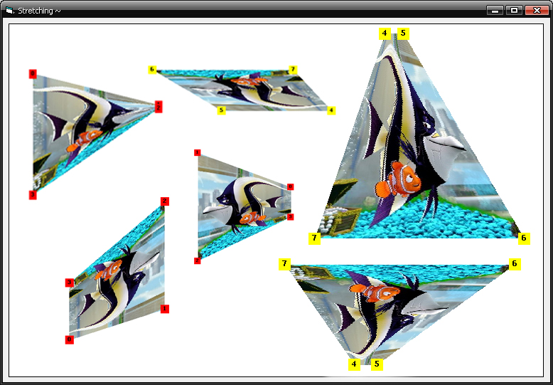



## Drag to stretch\!

### Description

Drag and stretch perspective in x, y direction as you wish!
 
### More Info
 

             |
---                |---
**Submitted On**   |2009-12-24 17:04:32
**By**             |[Tmax](https://github.com/Planet-Source-Code/PSCIndex/blob/master/ByAuthor/tmax.md)
**Level**          |Advanced
**User Rating**    |5.0 (65 globes from 13 users)
**Compatibility**  |VB 6\.0
**Category**       |[Graphics](https://github.com/Planet-Source-Code/PSCIndex/blob/master/ByCategory/graphics__1-46.md)
**World**          |[Visual Basic](https://github.com/Planet-Source-Code/PSCIndex/blob/master/ByWorld/visual-basic.md)
**Archive File**   |[Drag\_to\_st217194162010\.zip](https://github.com/Planet-Source-Code/tmax-drag-to-stretch__1-72805/archive/master.zip)

